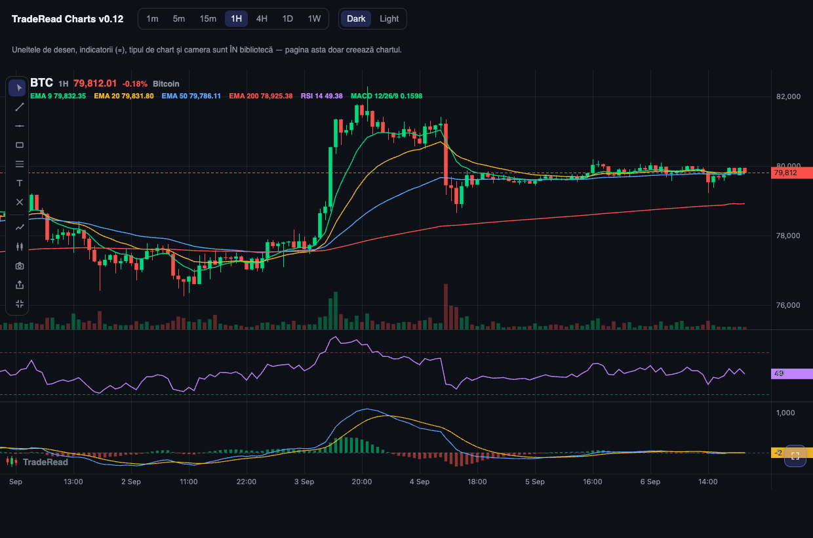

# TradeRead Charts

**A complete financial charting widget for JavaScript — not just an engine.**
Candlestick charts, technical indicators with a TradingView-style panel,
drawing tools, symbol search, light/dark themes: everything included, zero
dependencies, one `<script>` tag. A free, self-hosted alternative to
TradingView's Lightweight Charts™ for anyone who wants the whole widget,
not a bare canvas.



- 🕯️ 7 chart types: candles, hollow candles, Heikin Ashi, OHLC bars, line, area, baseline
- 📊 Built-in indicators: unlimited EMAs/SMAs, VWAP, Bollinger, RSI, MACD, Stochastic — add, remove, rename, recolor from the bundled panel
- ✏️ Drawing tools: trend line, horizontal, rectangle, Fibonacci retracement, text — move, resize, style, persisted per symbol
- 🔎 Symbol search by ticker **or name**, with a pluggable data source (keyless Binance adapter included)
- 📱 Touch-first: pinch zoom, one-finger drawing, momentum scrolling
- 🌗 Light & dark themes, live-switchable
- ⚡ 50,000 candles load in ~1.4 ms; dense repaint under 1 ms
- 🏭 In production on [traderead.ai](https://traderead.ai) — the interactive widget, the AI-read captures and every chart posted to X

A financial charting engine built from first principles by TradeRead —
candlesticks, volume, overlays, crosshair, inertia-free pan/zoom, touch,
high-DPI rendering. No third-party rendering code: every line in `src/`
is original TradeRead work, written from public behavior specifications,
so the engine is TradeRead intellectual property in full.

**Status: v0.21 — in production.** Since 7 Sep 2026 this engine renders
every chart on [traderead.ai](https://traderead.ai): the interactive
widget, the AI-read captures and the images posted to X. Candles, volume, line overlays (EMA/VWAP/Bollinger),
oscillator sub-panes (RSI/MACD/Stochastic) with per-pane scales and
guides, the full drawing set (trend, horizontal, rectangle, Fibonacci
retracement, text) with selection, move, resize, delete and per-key
persistence, adaptive price/time scales, pane-aware crosshair,
wheel/trackpad/drag/touch navigation, light & dark palettes, live bar
updates, built-in TradeRead mark.

Hard-won rules carried over from the production widget: drawings anchor
to (time, price) because lazy history prepends bars and shifts indices;
the price pane autoscales from bars alone so a distant EMA cannot squash
the candles; persisted JSON strips cached text widths; Delete never
fires while a form field has focus.

## The plus over a bare engine

`ui: true` (the default) mounts the complete widget, not just a canvas:
the drawing rail, a TradingView-style indicator panel (any number of
EMAs/SMAs, VWAP, Bollinger, RSI, MACD, Stochastic — add, remove, edit
params, all persisted per key), a chart-type menu (seven types,
Heikin Ashi included) and a PNG snapshot that opens a preview with explicit Download / Copy actions — nothing downloads by itself. Hosts that want only the
engine pass `ui: false` and drive the same APIs themselves.

## Quick start

```html
<script src="src/traderead-charts.js"></script>
<div id="chart" style="width:800px;height:480px"></div>
<script>
  const chart = TRCharts.createChart(document.getElementById("chart"));
  chart.setData(bars);              // [{time, open, high, low, close, volume}]
  chart.addLine("ema20", ema20);    // [{time, value}]
  chart.update(lastBar);            // live tick
</script>
```

## Roadmap to parity with the production widget
- [x] Sub-panes (RSI / MACD / Stochastic)
- [x] Drawing set with selection, move, resize, persistence
- [x] Light theme palette
- [x] Draggable pane separators (mouse and touch)
- [x] Chart types, picked from a menu: candles, hollow candles, Heikin Ashi, OHLC bars, line, area, baseline
- [x] Markers (arrows/circles with text, above/below bars)
- [ ] Per-bar coloring API
- [x] Kinetic scroll (momentum glide with decay); pinch anchor refinement pending
- [x] Two-click drawing (click, move, click — drag still works; Esc aborts)
- [x] Resizable text (drag the size grip on the selection)
- [x] Symbol header (ticker · timeframe · live price · change)
- [x] Vertical price zoom on the axis wheel (dblclick resets)
- [x] Fullscreen button (prominent, bottom-right)
- [x] Share (native sheet on phones, clipboard on desktop) and Fit chart
- [x] Symbol search: by ticker OR name, dropdown on ambiguity — the UI ships
      with the widget, the data source is pluggable (`symbolSearch.search` /
      `onSelect`); the demo bundles a keyless Binance adapter
- [x] Per-drawing color (floating chip on selection — boxes, lines, text)
- [x] Per-indicator color picker and custom rename (panel, legend and pane title follow)
- [x] Oscillator panes carry their own titles
- [x] Indicator legend with live numeric values (crosshair-tracked) and last-value tags on each oscillator's axis
- [x] `tick(price)` with the bucket roll built in — a closed candle always
      opens the next one (a production bug class, ended in the library)
- [x] Mobile drawing hardening: touch lock while a tool is armed, cancel commits the in-flight shape, one-finger draw/move, two-finger always navigates

## Editions (open-core plan)

- **Standard** (this repo, free): everything you see, up to 4 indicators
  per chart (`maxIndicators: 4`), standard timeframes incl. 30m, TradeRead
  mark required.
- **Pro** (paid, private repo — contact via traderead.ai): unlimited indicators, custom timeframes — the
  bundled `TRCharts.resample()` turns any finer feed into 2m/3m or the
  calendar frames 1M/1Y, so custom frames work with every data source.
  Client-side limits are honesty gates, not DRM: the licence is the
  enforcement, as with every client-side library.

## License
**TradeRead Community License 1.0** — free for personal and commercial
use, modification and redistribution. One condition: any public page or
image that shows charts rendered by this engine keeps the TradeRead mark
visible (it is built in and on by default), or an equivalent "Charts by
TradeRead" notice linking to traderead.ai. Full text in LICENSE.md.
